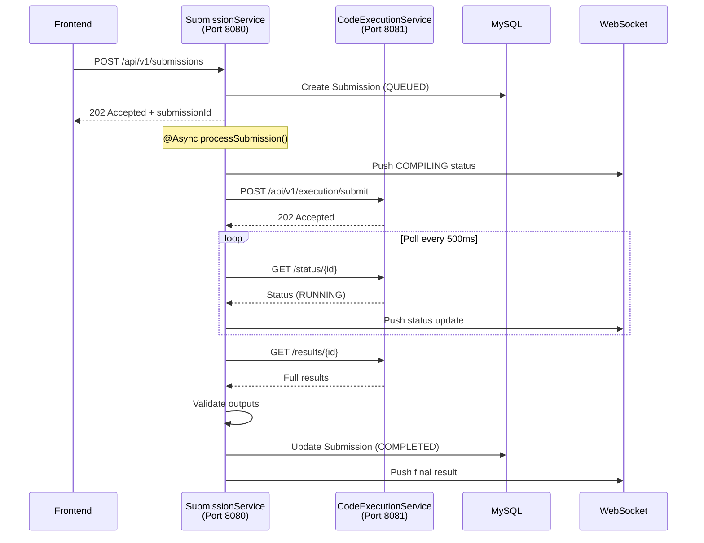

# AlgoCrack Submission Service - Updated Context

## Overview

**AlgoCrack-SubmissionService** is a Spring Boot microservice that handles code submissions for a LeetCode-like platform. It receives code submissions from the frontend, processes them asynchronously via HTTP communication with the CodeExecutionService, and provides real-time updates via WebSocket.

---

## New Architecture (Post-Upgrade)



---

## Technology Stack

| Category | Technology | Version |
|----------|------------|---------|
| Framework | Spring Boot | 3.5.4 |
| Language | Java | 24 |
| Build Tool | Gradle | - |
| Database | MySQL | - |
| ORM | Spring Data JPA | - |
| HTTP Client | Spring WebFlux (WebClient) | - |
| Real-time Comm | Spring WebSocket (STOMP) | - |
| Annotations | Lombok | - |

---

## Dependencies

```groovy
dependencies {
    implementation 'org.springframework.boot:spring-boot-starter-data-jpa'
    implementation 'org.springframework.boot:spring-boot-starter-web'
    implementation 'org.springframework.boot:spring-boot-starter-websocket'
    implementation 'org.springframework.boot:spring-boot-starter-webflux'
    implementation 'com.hrishabh:AlgoCrack-EntityService:0.0.8-SNAPSHOT'
}
```

---

## Package Structure

```
src/main/java/com/hrishabh/algocracksubmissionservice/
├── AlgoCrackSubmissionServiceApplication.java
├── config/
│   ├── AsyncConfig.java           # Thread pool for async processing
│   ├── WebClientConfig.java       # HTTP client for CXE
│   └── WebSocketConfig.java       # STOMP WebSocket broker
├── controllers/
│   └── SubmissionController.java  # REST API endpoints
├── dto/
│   ├── ExecutionRequest.java      # Request to CXE
│   ├── ExecutionResponse.java     # Response from CXE
│   ├── SubmissionDetailDto.java   # Detailed submission response
│   ├── SubmissionRequestDto.java  # API request
│   ├── SubmissionResponseDto.java # API response
│   └── SubmissionStatusDto.java   # CXE polling DTO
├── repository/
│   ├── QuestionMetadataRepository.java
│   ├── QuestionStatisticsRepository.java
│   ├── SubmissionRepository.java
│   └── TestcaseRepository.java
└── service/
    ├── CodeExecutionClientService.java   # HTTP client for CXE
    ├── QuestionService.java              # Question data fetching
    ├── ResultValidationService.java      # Output comparison
    ├── SubmissionProcessingService.java  # Async processing
    ├── SubmissionService.java            # Main orchestration
    └── WebSocketService.java             # Real-time updates
```

---

## REST API

### POST /api/v1/submissions

Submit code for asynchronous execution.

**Request:**
```json
{
    "userId": 1,
    "questionId": 1,
    "language": "java",
    "code": "class Solution { ... }"
}
```

**Response (202 Accepted):**
```json
{
    "submissionId": "a1b2c3d4-e5f6-...",
    "status": "QUEUED",
    "message": "Submission queued for processing"
}
```

### GET /api/v1/submissions/{submissionId}

Get submission details.

**Response:**
```json
{
    "submissionId": "a1b2c3d4-...",
    "status": "COMPLETED",
    "verdict": "ACCEPTED",
    "runtimeMs": 45,
    "memoryKb": 12048,
    "passedTestCases": 5,
    "totalTestCases": 5
}
```

### GET /api/v1/submissions/user/{userId}

Get user's submission history with pagination.

---

## WebSocket

**Endpoint:** `ws://localhost:8080/ws`

**Subscribe:** `/topic/submission/{submissionId}`

**Messages:**
```json
// Status update
{"submissionId": "abc", "status": "RUNNING"}

// Final result
{"submissionId": "abc", "status": "COMPLETED", "verdict": "ACCEPTED", "runtimeMs": 45}

// Error
{"submissionId": "abc", "status": "FAILED", "error": "Execution timeout"}
```

---

## Data Models (from EntityService)

### Submission Entity

| Field | Type | Description |
|-------|------|-------------|
| `id` | Long | Primary key |
| `submissionId` | String | UUID for external reference |
| `user` | User | ManyToOne relationship |
| `question` | Question | ManyToOne relationship |
| `language` | String | java, python, etc. |
| `code` | String (TEXT) | User's solution code |
| `status` | SubmissionStatus | QUEUED, COMPILING, RUNNING, COMPLETED, FAILED |
| `verdict` | SubmissionVerdict | ACCEPTED, WRONG_ANSWER, TLE, etc. |
| `runtimeMs` | Integer | Execution time |
| `memoryKb` | Integer | Memory usage |
| `passedTestCases` | Integer | Count of passed tests |
| `totalTestCases` | Integer | Total tests |
| `queuedAt` | LocalDateTime | When queued |
| `startedAt` | LocalDateTime | When execution started |
| `completedAt` | LocalDateTime | When completed |
| `workerId` | String | Worker that processed |

### SubmissionStatus Enum

- `QUEUED` - Waiting for processing
- `COMPILING` - Code being compiled
- `RUNNING` - Executing test cases
- `COMPLETED` - Execution finished
- `FAILED` - System error
- `CANCELLED` - Cancelled by user/timeout

### SubmissionVerdict Enum

- `ACCEPTED` - All tests passed
- `WRONG_ANSWER` - Output mismatch
- `TIME_LIMIT_EXCEEDED` - Too slow
- `MEMORY_LIMIT_EXCEEDED` - Too much memory
- `RUNTIME_ERROR` - Exception during execution
- `COMPILATION_ERROR` - Failed to compile
- `INTERNAL_ERROR` - System error

---

## Configuration

### application.yml

```yaml
server:
  port: 8080

cxe:
  service:
    url: http://localhost:8081

async:
  core-pool-size: 5
  max-pool-size: 20
  queue-capacity: 100
```

---

## Infrastructure Requirements

| Service | Port | Purpose |
|---------|------|---------|
| MySQL | 3306 | Database |
| SubmissionService | 8080 | User-facing API |
| CodeExecutionService | 8081 | Code execution |
| Redis | 6379 | CXE's internal queue |

**Startup Order:**
1. MySQL
2. Redis
3. CodeExecutionService
4. SubmissionService
