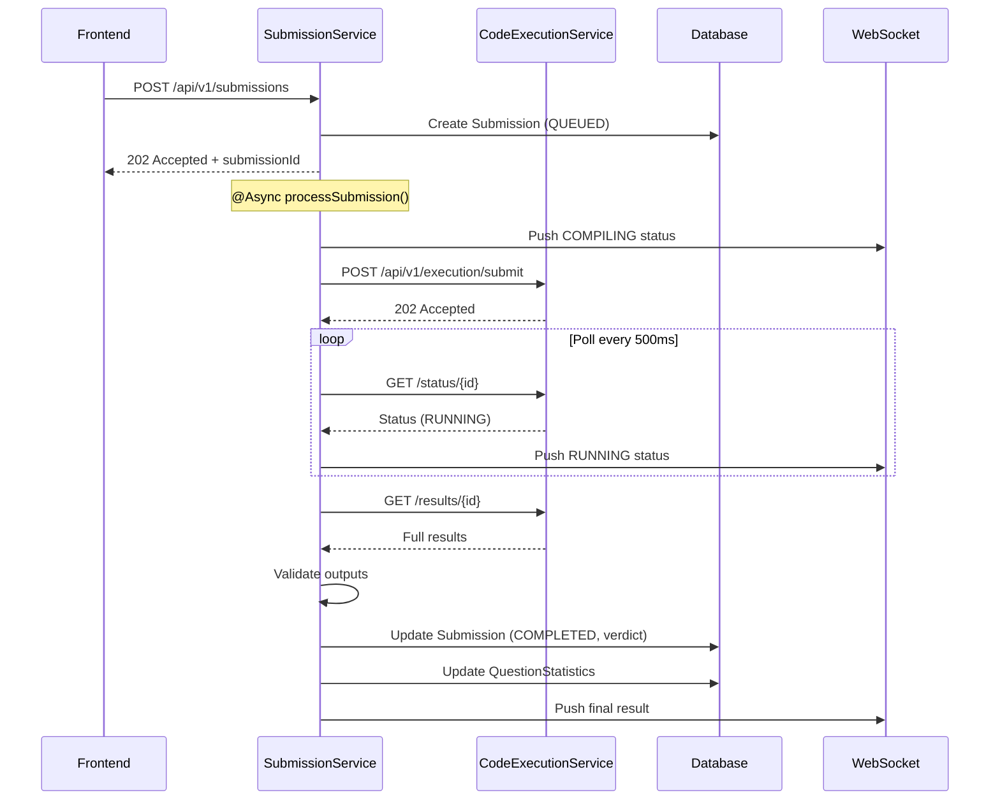

# Submission Service - Final Upgrade Plan

## Executive Summary

This document outlines the complete plan to upgrade **AlgoCrack-SubmissionService** to work with the new scalable architecture. The CodeExecutionEngine is now a standalone REST microservice, and the Entity Service has been upgraded with async tracking entities.

---

## Architecture Comparison

### Before (Current State)

```
┌─────────────────────────────────────────────────────────────┐
│                   Submission Service                         │
│                                                             │
│  POST /submit → SubmissionProducer → Kafka                  │
│                                        ↓                    │
│                                 SubmissionConsumer          │
│                                        ↓                    │
│                                 CodeRunnerService           │
│                                        ↓                    │
│                          CodeExecutionManager (Library)     │
│                          [BLOCKS 10+ SECONDS]               │
│                                        ↓                    │
│                               Returns result                │
└─────────────────────────────────────────────────────────────┘

Issues:
❌ Kafka consumer thread blocked during execution
❌ No result persistence
❌ No polling support
❌ Cannot scale execution independently
```

### After (Target State)

```
┌────────────────────────────────────────────────────────────────────┐
│                   Submission Service (Port 8080)                    │
│                                                                     │
│  POST /api/v1/submissions → SubmissionService                      │
│       │                          ↓                                 │
│       │                    Create Submission (status=QUEUED)       │
│       │                          ↓                                 │
│       │                    HTTP POST to CXE                        │
│       │                          ↓                                 │
│       └────────────────→ Return 202 Accepted                       │
│                                                                     │
│  @Async processSubmission()                                         │
│       │                                                            │
│       ├── Poll CXE for status                                      │
│       ├── Compare actual vs expected outputs                       │
│       ├── Update Submission (verdict, metrics)                     │
│       ├── Update QuestionStatistics                                │
│       └── Push WebSocket update                                    │
└────────────────────────────────────────────────────────────────────┘
                              │
                              │ HTTP
                              ▼
┌────────────────────────────────────────────────────────────────────┐
│               Code Execution Service (Port 8081)                    │
│                                                                     │
│  POST /api/v1/execution/submit → Queue → Workers → Execute        │
│  GET  /api/v1/execution/status/{id} → Return status               │
│  GET  /api/v1/execution/results/{id} → Return full results        │
└────────────────────────────────────────────────────────────────────┘
```

---

## Changes Summary from Dependent Services

### CodeExecutionEngine Changes (Already Done ✅)

| Change | Description |
|--------|-------------|
| Library → Microservice | Now runs on port 8081 |
| Sync → Async | Returns immediately, process in background |
| Redis Queue | Worker pool pulls from queue |
| New Endpoints | `POST /submit`, `GET /status/{id}`, `GET /results/{id}` |
| Persistence | Saves results to database |

### Entity Service Changes (Already Done ✅)

| Entity | Changes |
|--------|---------|
| `Submission.java` | Added: `submissionId` UUID, `status` enum, `verdict` enum, `runtimeMs`, `memoryKb`, `testResults` JSON, timestamps, `workerId` |
| `SubmissionStatus.java` | New enum: QUEUED, COMPILING, RUNNING, COMPLETED, FAILED, CANCELLED |
| `SubmissionVerdict.java` | New enum: ACCEPTED, WRONG_ANSWER, TLE, MLE, RE, CE, INTERNAL_ERROR |
| `QuestionStatistics.java` | New entity for per-question analytics |
| `ExecutionMetrics.java` | Fixed package, now extends BaseModel |

---

## Implementation Plan

### Phase 1: Remove CXE Library Dependency

#### 1.1 Update build.gradle

```diff
dependencies {
    implementation 'org.springframework.boot:spring-boot-starter-data-jpa'
    implementation 'org.springframework.boot:spring-boot-starter-web'
    implementation 'org.springframework.boot:spring-boot-starter-websocket'
-   implementation 'org.springframework.kafka:spring-kafka'
-   implementation 'xyz.hrishabhjoshi:CodeExecutionEngine:1.0.2'
+   implementation 'com.github.hrishabh6:AlgoCrack-EntityService:v2.0.0'
    
    // Add for HTTP client
+   implementation 'org.springframework.boot:spring-boot-starter-webflux'
}

repositories {
    mavenCentral()
+   maven { url 'https://jitpack.io' }
}
```

#### 1.2 Update Application Class

```diff
@SpringBootApplication
@EntityScan("com.hrishabh.algocrackentityservice.models")
@EnableJpaRepositories("com.hrishabh.algocracksubmissionservice.repository")
- @ComponentScan(basePackages = {
-     "com.hrishabh.algocracksubmissionservice",
-     "com.hrishabh.codeexecutionengine"
- })
+ @EnableAsync
public class AlgoCrackSubmissionServiceApplication { ... }
```

---

### Phase 2: Add HTTP Client for CXE

#### 2.1 Create Config

**File:** `config/WebClientConfig.java`

```java
@Configuration
public class WebClientConfig {

    @Value("${cxe.service.url:http://localhost:8081}")
    private String cxeServiceUrl;

    @Bean
    public WebClient cxeWebClient() {
        return WebClient.builder()
            .baseUrl(cxeServiceUrl)
            .defaultHeader(HttpHeaders.CONTENT_TYPE, MediaType.APPLICATION_JSON_VALUE)
            .build();
    }
}
```

#### 2.2 Create CXE Client Service

**File:** `service/CodeExecutionClientService.java`

```java
@Service
@RequiredArgsConstructor
public class CodeExecutionClientService {

    private final WebClient cxeWebClient;

    public ExecutionResponse submitCode(ExecutionRequest request) {
        return cxeWebClient.post()
            .uri("/api/v1/execution/submit")
            .bodyValue(request)
            .retrieve()
            .bodyToMono(ExecutionResponse.class)
            .block();
    }

    public SubmissionStatusDto getStatus(String submissionId) {
        return cxeWebClient.get()
            .uri("/api/v1/execution/status/{id}", submissionId)
            .retrieve()
            .bodyToMono(SubmissionStatusDto.class)
            .block();
    }

    public SubmissionStatusDto getResults(String submissionId) {
        return cxeWebClient.get()
            .uri("/api/v1/execution/results/{id}", submissionId)
            .retrieve()
            .bodyToMono(SubmissionStatusDto.class)
            .block();
    }
}
```

---

### Phase 3: Add Result Validation Service

**File:** `service/ResultValidationService.java`

```java
@Service
@RequiredArgsConstructor
public class ResultValidationService {

    private final ObjectMapper objectMapper;

    public SubmissionVerdict validateResults(
        List<TestCaseResult> actualResults,
        List<TestCase> expectedTestCases
    ) {
        for (int i = 0; i < actualResults.size(); i++) {
            TestCaseResult actual = actualResults.get(i);
            TestCase expected = expectedTestCases.get(i);

            if (actual.getError() != null) {
                return SubmissionVerdict.RUNTIME_ERROR;
            }

            if (!outputsMatch(actual.getActualOutput(), expected.getExpectedOutput())) {
                return SubmissionVerdict.WRONG_ANSWER;
            }
        }
        return SubmissionVerdict.ACCEPTED;
    }

    private boolean outputsMatch(String actual, String expected) {
        try {
            JsonNode actualNode = objectMapper.readTree(actual);
            JsonNode expectedNode = objectMapper.readTree(expected);
            return actualNode.equals(expectedNode);
        } catch (Exception e) {
            return actual.trim().equals(expected.trim());
        }
    }
}
```

---

### Phase 4: Refactor Submission Processing

#### 4.1 Add Repository

**File:** `repository/SubmissionRepository.java`

```java
public interface SubmissionRepository extends JpaRepository<Submission, Long> {

    Optional<Submission> findBySubmissionId(String submissionId);

    List<Submission> findByUserIdOrderByQueuedAtDesc(Long userId, Pageable pageable);

    @Query("SELECT COUNT(s) FROM Submission s WHERE s.status IN ('QUEUED', 'COMPILING', 'RUNNING')")
    Long countPendingSubmissions();
}
```

**File:** `repository/QuestionStatisticsRepository.java`

```java
public interface QuestionStatisticsRepository extends JpaRepository<QuestionStatistics, Long> {

    Optional<QuestionStatistics> findByQuestionId(Long questionId);
}
```

#### 4.2 Refactor CodeRunnerService → SubmissionProcessingService

**File:** `service/SubmissionProcessingService.java`

```java
@Slf4j
@Service
@RequiredArgsConstructor
public class SubmissionProcessingService {

    private final CodeExecutionClientService cxeClient;
    private final ResultValidationService validationService;
    private final SubmissionRepository submissionRepository;
    private final QuestionStatisticsRepository statsRepository;
    private final QuestionService questionService;
    private final WebSocketService webSocketService;

    @Async
    public void processSubmission(Submission submission) {
        try {
            // 1. Update status to COMPILING
            updateStatus(submission, SubmissionStatus.COMPILING);

            // 2. Build execution request
            ExecutionRequest request = buildExecutionRequest(submission);

            // 3. Submit to CXE
            ExecutionResponse response = cxeClient.submitCode(request);

            // 4. Poll for results
            SubmissionStatusDto result = pollForCompletion(response.getSubmissionId());

            // 5. Validate results
            List<TestCase> expected = questionService.getTestCases(submission.getQuestion().getId());
            SubmissionVerdict verdict = validationService.validateResults(
                result.getTestCaseResults(), expected
            );

            // 6. Update submission
            submission.setStatus(SubmissionStatus.COMPLETED);
            submission.setVerdict(verdict);
            submission.setRuntimeMs(result.getRuntimeMs());
            submission.setMemoryKb(result.getMemoryKb());
            submission.setCompletedAt(LocalDateTime.now());
            submission.setWorkerId(result.getWorkerId());
            submission.setPassedTestCases(countPassed(result.getTestCaseResults()));
            submission.setTotalTestCases(expected.size());
            submissionRepository.save(submission);

            // 7. Update question statistics
            updateQuestionStatistics(submission);

            // 8. Notify client
            webSocketService.sendResult(submission);

        } catch (Exception e) {
            log.error("Processing failed for {}: {}", submission.getSubmissionId(), e.getMessage());
            submission.setStatus(SubmissionStatus.FAILED);
            submission.setErrorMessage(e.getMessage());
            submissionRepository.save(submission);
            webSocketService.sendError(submission, e.getMessage());
        }
    }

    private SubmissionStatusDto pollForCompletion(String submissionId) {
        int maxAttempts = 60; // 30 seconds
        for (int i = 0; i < maxAttempts; i++) {
            SubmissionStatusDto status = cxeClient.getStatus(submissionId);
            if ("COMPLETED".equals(status.getStatus()) || "FAILED".equals(status.getStatus())) {
                return cxeClient.getResults(submissionId);
            }
            try {
                Thread.sleep(500);
            } catch (InterruptedException e) {
                Thread.currentThread().interrupt();
                throw new RuntimeException("Polling interrupted");
            }
        }
        throw new RuntimeException("Execution timeout");
    }

    @Transactional
    private void updateQuestionStatistics(Submission submission) {
        Long questionId = submission.getQuestion().getId();
        QuestionStatistics stats = statsRepository.findByQuestionId(questionId)
            .orElseGet(() -> QuestionStatistics.builder()
                .questionId(questionId)
                .totalSubmissions(0)
                .acceptedSubmissions(0)
                .build());

        stats.incrementSubmissions(
            submission.isAccepted(),
            submission.getRuntimeMs(),
            submission.getMemoryKb()
        );
        statsRepository.save(stats);
    }
}
```

---

### Phase 5: Update REST Controller

**File:** `controllers/SubmissionController.java`

```java
@RestController
@RequestMapping("/api/v1/submissions")
@RequiredArgsConstructor
public class SubmissionController {

    private final SubmissionService submissionService;

    @PostMapping
    public ResponseEntity<SubmissionResponseDto> submit(@RequestBody SubmissionRequestDto request) {
        Submission submission = submissionService.createAndProcess(request);

        return ResponseEntity.accepted().body(SubmissionResponseDto.builder()
            .submissionId(submission.getSubmissionId())
            .status(submission.getStatus().name())
            .message("Submission queued for processing")
            .build());
    }

    @GetMapping("/{submissionId}")
    public ResponseEntity<SubmissionDetailDto> getSubmission(@PathVariable String submissionId) {
        return submissionService.findBySubmissionId(submissionId)
            .map(ResponseEntity::ok)
            .orElse(ResponseEntity.notFound().build());
    }

    @GetMapping("/user/{userId}")
    public ResponseEntity<List<SubmissionSummaryDto>> getUserSubmissions(
        @PathVariable Long userId,
        @RequestParam(defaultValue = "0") int page,
        @RequestParam(defaultValue = "20") int size
    ) {
        return ResponseEntity.ok(submissionService.getUserSubmissions(userId, page, size));
    }
}
```

---

### Phase 6: Add WebSocket Support

**File:** `config/WebSocketConfig.java`

```java
@Configuration
@EnableWebSocketMessageBroker
public class WebSocketConfig implements WebSocketMessageBrokerConfigurer {

    @Override
    public void configureMessageBroker(MessageBrokerRegistry config) {
        config.enableSimpleBroker("/topic");
        config.setApplicationDestinationPrefixes("/app");
    }

    @Override
    public void registerStompEndpoints(StompEndpointRegistry registry) {
        registry.addEndpoint("/ws").setAllowedOrigins("*").withSockJS();
    }
}
```

**File:** `service/WebSocketService.java`

```java
@Service
@RequiredArgsConstructor
public class WebSocketService {

    private final SimpMessagingTemplate messagingTemplate;

    public void sendStatus(Submission submission) {
        messagingTemplate.convertAndSend(
            "/topic/submission/" + submission.getSubmissionId(),
            Map.of(
                "submissionId", submission.getSubmissionId(),
                "status", submission.getStatus().name()
            )
        );
    }

    public void sendResult(Submission submission) {
        messagingTemplate.convertAndSend(
            "/topic/submission/" + submission.getSubmissionId(),
            Map.of(
                "submissionId", submission.getSubmissionId(),
                "status", "COMPLETED",
                "verdict", submission.getVerdict().name(),
                "runtimeMs", submission.getRuntimeMs(),
                "passedTestCases", submission.getPassedTestCases(),
                "totalTestCases", submission.getTotalTestCases()
            )
        );
    }

    public void sendError(Submission submission, String error) {
        messagingTemplate.convertAndSend(
            "/topic/submission/" + submission.getSubmissionId(),
            Map.of(
                "submissionId", submission.getSubmissionId(),
                "status", "FAILED",
                "error", error
            )
        );
    }
}
```

---

### Phase 7: Remove Kafka Components

**Delete these files:**

| File | Reason |
|------|--------|
| `config/KafkaConfiguration.java` | No longer needed |
| `producer/SubmissionProducer.java` | CXE handles queueing |
| `producer/LogsProducer.java` | WebSocket replaces Kafka logs |
| `consumer/SubmissionConsumer.java` | Replaced by async processing |
| `consumer/LogsConsumer.java` | WebSocket replaces |

---

## File Change Summary

| Action | File | Description |
|--------|------|-------------|
| MODIFY | `build.gradle` | Remove Kafka/CXE library, add JitPack/WebFlux |
| MODIFY | `AlgoCrackSubmissionServiceApplication.java` | Remove ComponentScan, add @EnableAsync |
| CREATE | `config/WebClientConfig.java` | CXE HTTP client config |
| CREATE | `config/WebSocketConfig.java` | WebSocket broker config |
| CREATE | `config/AsyncConfig.java` | Async executor config |
| CREATE | `service/CodeExecutionClientService.java` | HTTP client for CXE |
| CREATE | `service/ResultValidationService.java` | Compare actual vs expected |
| CREATE | `service/WebSocketService.java` | Real-time updates |
| MODIFY | `service/CodeRunnerService.java` → `SubmissionProcessingService.java` | Refactor to async |
| CREATE | `repository/SubmissionRepository.java` | Submission queries |
| CREATE | `repository/QuestionStatisticsRepository.java` | Stats queries |
| MODIFY | `controllers/SubmissionController.java` | New REST structure |
| CREATE | `dto/SubmissionRequestDto.java` | Request DTO |
| CREATE | `dto/SubmissionResponseDto.java` | Response DTO |
| CREATE | `dto/ExecutionRequest.java` | CXE request DTO |
| CREATE | `dto/ExecutionResponse.java` | CXE response DTO |
| DELETE | `config/KafkaConfiguration.java` | Remove Kafka |
| DELETE | `producer/SubmissionProducer.java` | Remove Kafka |
| DELETE | `producer/LogsProducer.java` | Remove Kafka |
| DELETE | `consumer/SubmissionConsumer.java` | Remove Kafka |
| DELETE | `consumer/LogsConsumer.java` | Remove Kafka |

---

## Configuration Updates

**application.yml:**

```yaml
server:
  port: 8080

spring:
  application:
    name: AlgoCrack-SubmissionService
  datasource:
    url: jdbc:mysql://localhost:3306/leetcode
    username: root
    password: ${DB_PASSWORD}
  jpa:
    hibernate:
      ddl-auto: validate
    show-sql: true

# Code Execution Service
cxe:
  service:
    url: http://localhost:8081
    timeout-seconds: 30

# Async processing
async:
  core-pool-size: 5
  max-pool-size: 20
  queue-capacity: 100
```

---

## API Specification

### POST /api/v1/submissions

**Request:**
```json
{
  "userId": 1,
  "questionId": 1,
  "language": "java",
  "code": "class Solution { ... }"
}
```

**Response (202 Accepted):**
```json
{
  "submissionId": "a1b2c3d4-e5f6-...",
  "status": "QUEUED",
  "message": "Submission queued for processing"
}
```

### GET /api/v1/submissions/{submissionId}

**Response:**
```json
{
  "submissionId": "a1b2c3d4-...",
  "status": "COMPLETED",
  "verdict": "ACCEPTED",
  "runtimeMs": 45,
  "memoryKb": 12048,
  "passedTestCases": 5,
  "totalTestCases": 5,
  "queuedAt": "2024-01-20T10:00:00",
  "completedAt": "2024-01-20T10:00:03"
}
```

### WebSocket /topic/submission/{submissionId}

Real-time status updates pushed to connected clients.

---

## Sequence Diagram



---

## Implementation Order

1. **Update dependencies** (build.gradle)
2. **Add HTTP client** (WebClientConfig, CodeExecutionClientService)
3. **Add repositories** (SubmissionRepository, QuestionStatisticsRepository)
4. **Add validation service** (ResultValidationService)
5. **Add WebSocket** (WebSocketConfig, WebSocketService)
6. **Refactor processing** (SubmissionProcessingService)
7. **Update controller** (SubmissionController)
8. **Add DTOs** (Request/Response classes)
9. **Remove Kafka** (Delete 5 files)
10. **Update configuration** (application.yml)
11. **Test end-to-end**

---

## Infrastructure Requirements

| Service | Port | Purpose |
|---------|------|---------|
| MySQL | 3306 | Database |
| SubmissionService | 8080 | User-facing API |
| CodeExecutionService | 8081 | Code execution |
| Redis | 6379 | CXE queue (managed by CXE) |

**Startup Order:**
1. MySQL
2. Redis  
3. CodeExecutionService
4. SubmissionService
